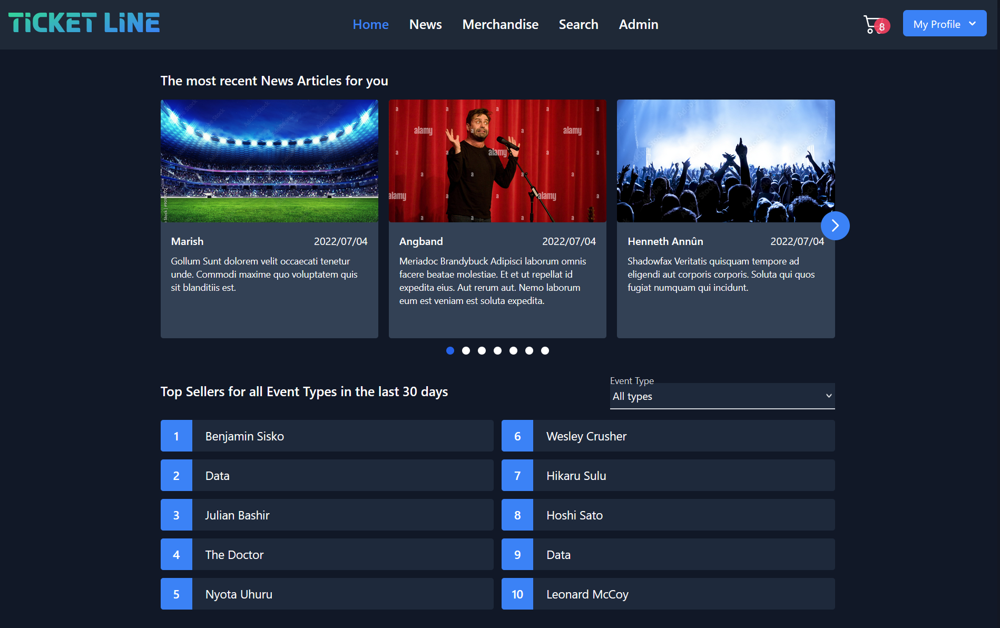

# SEPM Group Project Frontend

This is the *frontend* of the ticket service website we built as a part of the TU Wien 2022 SEPM course.  
The backend is not included, instead we whipped up a *mocked* version of it. Try searching for the merchandise named `cat`. 

[Check it out in action here]()



# Internal Info

## How to run it

Make sure to install all the dependencies using
```sh
npm install
```

### Compile and Hot-Reload for Development

And then the frontend can be started using
```sh
npm run dev
```

### Typecheck 

To make sure that we don't have any Typescript errors
```sh
npm run typecheck
```

### Lint with [ESLint](https://eslint.org/)

And Eslint will politely catch a few mistakes or just style guide violations
```sh
npm run lint
```

